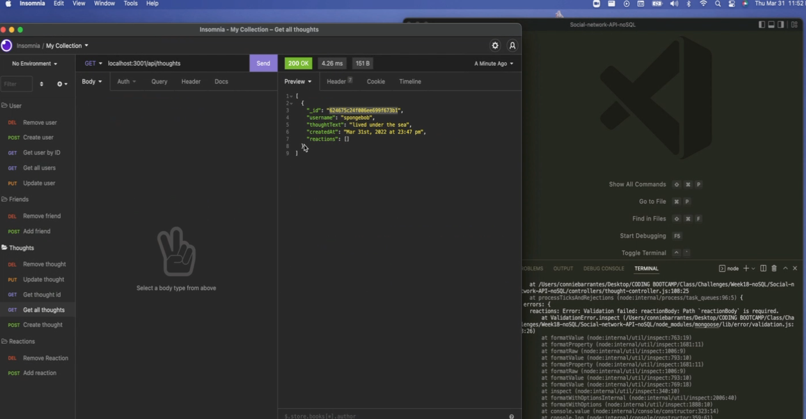
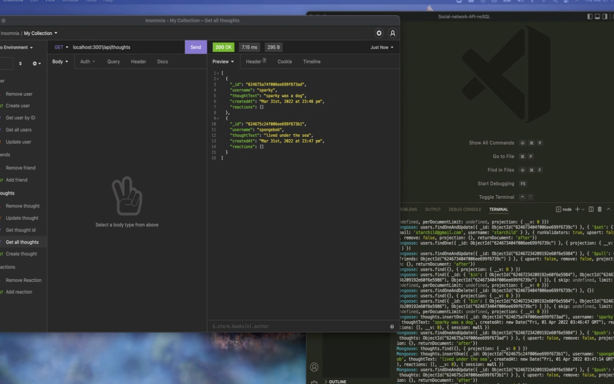
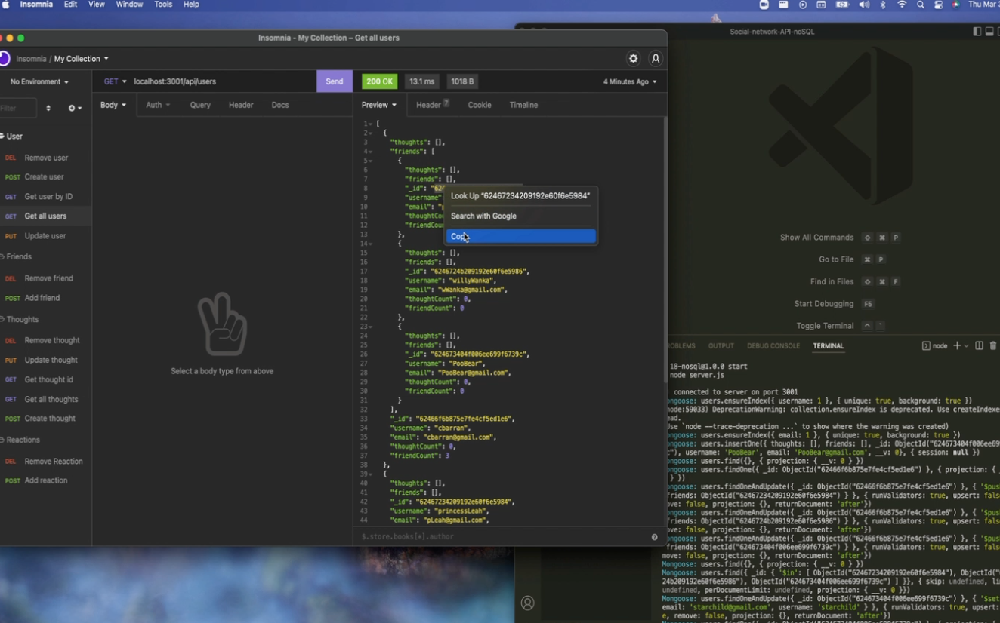
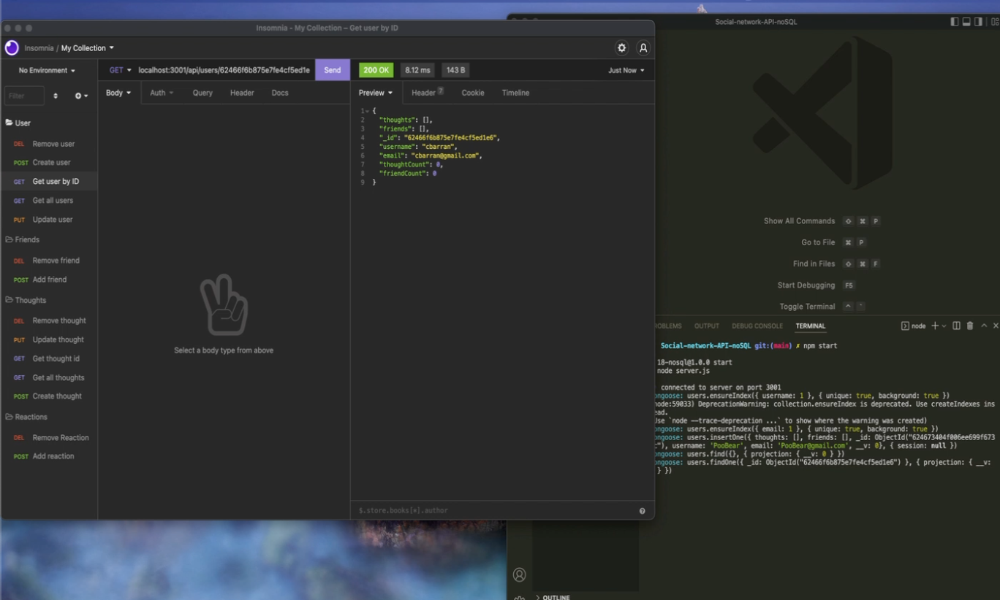

# Social-network-API-noSQL

## Purpose
Back-end for social network application.

## Table of Contents
- [Built With](#built-with)
- [Installation](#installation)
- [Walkthrough](#walkthrough)
- [Contribution](#contribution)

## Built With
- Node.js
- Express.js
- MongoDB
- Mongoose
- Insomnia

## Installation
To install this application, the following steps must be taken:
1. Install Node.js
2. Clone this repository
3. Access repository directory through terminal
4. Install Express.js, and Mongoose by typing the following into the terminal: 
https://www.npmjs.com/package/express
https://www.npmjs.com/package/mongoose
```
npm install
```

## Application Demo
This application demonstrates the database for a social networking application. 
[](https://drive.google.com/file/d/1lunaclcF4BcQdUvyfkv13asYBJ2nqCj2/view)
[](https://drive.google.com/file/d/15ua3nwkp019iY5Km06AmasAXOoZpHN_D/view)
[](https://drive.google.com/file/d/1riT71W0BL_4Ag6T0YOIEQD66ieHpNb58/view)
[](https://drive.google.com/file/d/1RjcxSfGE_LPHETbC17QWQwCnkRqvd8LD/view)

## Contribution
* Made with ❤️ by Connie Barrantes

## Questions
* If you have any question please contact me at [connie.s.barrantes@gmail.com](mailto:connie.s.barrantes@gmail.com). View more of my work at [barrantesc](https://github.com/barrantesc)
